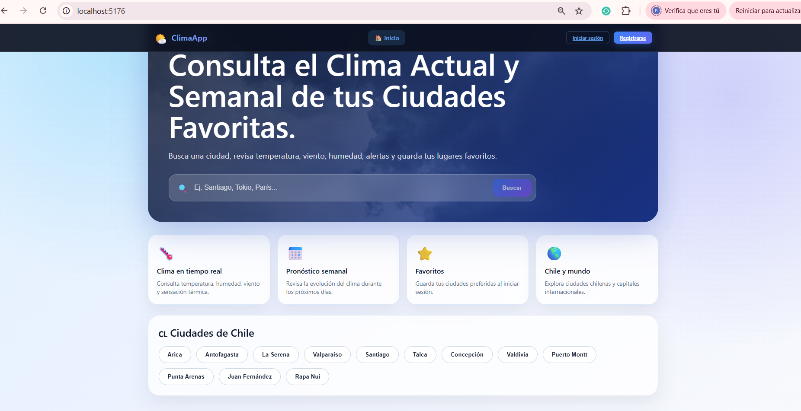
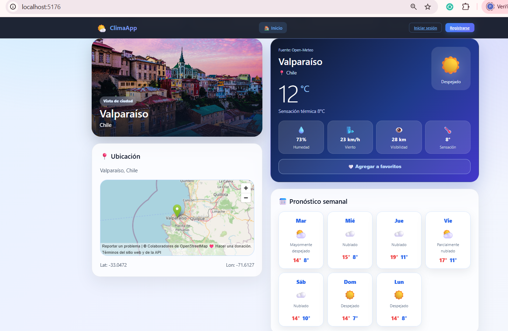
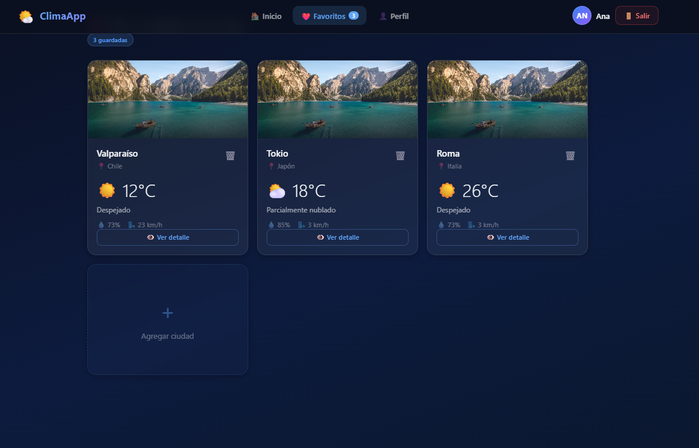
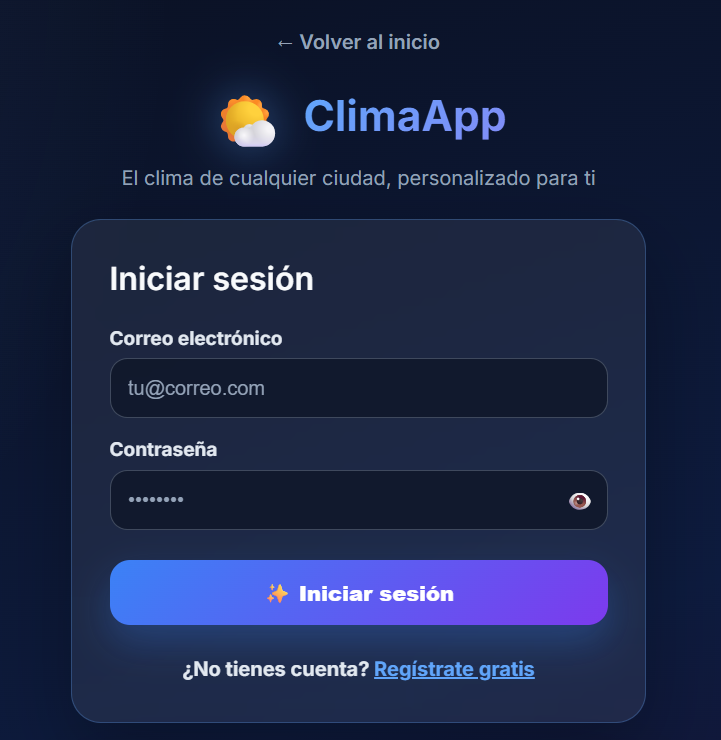
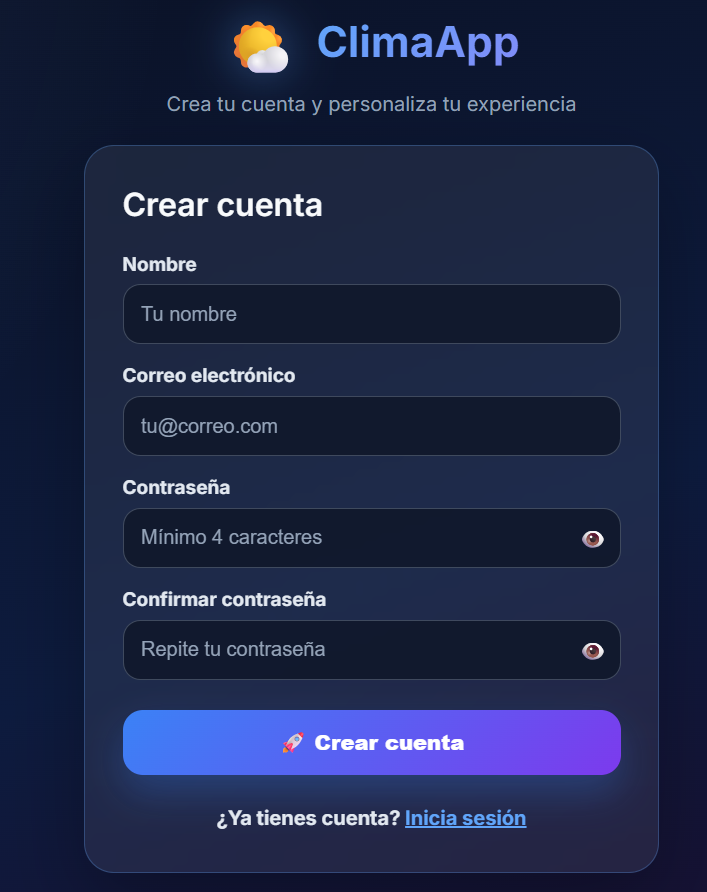
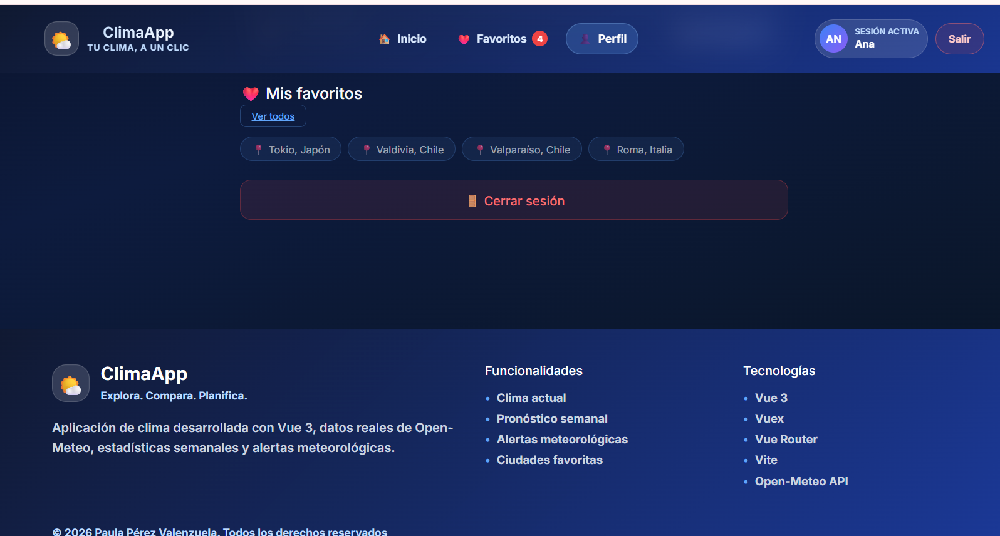

# 🌤️ ClimaApp | Weather Dashboard


Aplicación web desarrollada con **Vue 3**, **Vuex**, **Vue Router** y **Vite**, que permite consultar el clima en tiempo real de ciudades de Chile y del mundo mediante la API de **Open-Meteo**.

La aplicación incorpora autenticación de usuarios, gestión de ciudades favoritas, estadísticas meteorológicas, alertas climáticas y una interfaz moderna completamente responsive.

---
## 📑 Índice

- [🚀 Demo](#-demo)
- [📸 Capturas de la aplicación](#-capturas-de-la-aplicación)
- [✨ Características principales](#-características-principales)
- [🛠️ Tecnologías utilizadas](#️-tecnologías-utilizadas)
- [📂 Estructura del proyecto](#-estructura-del-proyecto)
- [⚙️ Instalación](#️-instalación)
- [🌍 APIs utilizadas](#-apis-utilizadas)
- [👤 Funcionalidades](#-funcionalidades)
- [📱 Diseño Responsive](#-diseño-responsive)
- [🔮 Mejoras futuras](#-mejoras-futuras)
- [👩‍💻 Autora](#-autora)
- [📄 Licencia](#-licencia)


# 🚀 Demo

### 🌐 Aplicación

https://clima-app-portfolio.vercel.app/#/

### 💻 Repositorio

https://github.com/Paula-front/Clima-app-portfolio

---

# 📸 Capturas de la aplicación

## 🏠 Página principal



---

## 🌤️ Consulta del clima



---

## ❤️ Favoritos



---

## 🔐 Inicio de sesión



---

## 📝 Registro



---

## 👤 Perfil de usuario



---

# ✨ Características principales

* 🌤️ Consulta del clima en tiempo real.
* 📅 Pronóstico meteorológico de 7 días.
* 🌎 Búsqueda de ciudades mediante Open-Meteo Geocoding.
* 🇨🇱 Accesos rápidos a ciudades de Chile.
* 🌍 Consulta de capitales internacionales.
* 📊 Estadísticas climáticas semanales.
* 🚨 Alertas meteorológicas según las condiciones actuales.
* 🌡️ Conversión entre grados Celsius y Fahrenheit.
* ❤️ Gestión de ciudades favoritas.
* 🔐 Registro e inicio de sesión.
* 👤 Perfil de usuario.
* 🎨 Interfaz moderna y responsive.
* 🚀 Despliegue en Vercel.

---

# 🛠️ Tecnologías utilizadas

* Vue 3
* Vuex
* Vue Router
* Vite
* JavaScript (ES6+)
* HTML5
* CSS3
* Open-Meteo API
* Open-Meteo Geocoding API
* Git
* GitHub
* Vercel

---

# 📂 Estructura del proyecto

```text
src
│
├── assets
│   ├── images
│   └── styles
│
├── components
│   ├── Navbar.vue
│   ├── Footer.vue
│   ├── WeatherCard.vue
│   ├── ForecastCard.vue
│   ├── WeekStats.vue
│   ├── CityImage.vue
│   └── StatCard.vue
│
├── router
│
├── services
│   ├── authService.js
│   └── weatherService.js
│
├── store
│   ├── index.js
│   └── modules
│       ├── auth.js
│       └── weather.js
│
├── views
│   ├── HomeView.vue
│   ├── LoginView.vue
│   ├── RegistroView.vue
│   ├── FavoritosView.vue
│   └── PerfilView.vue
│
├── App.vue
└── main.js
```

---

# ⚙️ Instalación

Clonar el repositorio

```bash
git clone https://github.com/Paula-front/Clima-app-portfolio.git
```

Ingresar al proyecto

```bash
cd Clima-app-portfolio
```

Instalar dependencias

```bash
npm install
```

Ejecutar en desarrollo

```bash
npm run dev
```

Generar la versión de producción

```bash
npm run build
```

---

# 🌍 APIs utilizadas

## Open-Meteo API

Servicios utilizados:

* Forecast API
* Geocoding API

Sitio oficial:

https://open-meteo.com/

---

# 👤 Funcionalidades

## Visitantes

* Consultar el clima actual.
* Buscar ciudades.
* Visualizar pronóstico semanal.
* Revisar estadísticas.
* Consultar alertas meteorológicas.

## Usuarios registrados

Además de las funciones anteriores:

* Crear una cuenta.
* Iniciar sesión.
* Administrar ciudades favoritas.
* Gestionar su perfil.
* Mantener sus preferencias de usuario.

---

# 📱 Diseño Responsive

La aplicación fue diseñada siguiendo un enfoque **Responsive Design**, ofreciendo una experiencia óptima en:

* 💻 Escritorio
* 📱 Teléfonos móviles
* 📱 Tablets

---

# 🔮 Mejoras futuras

* 📍 Geolocalización automática.
* 🌙 Persistencia del modo claro/oscuro.
* 🕒 Historial de búsquedas recientes.
* 🌧️ Radar meteorológico.
* 🔔 Notificaciones de alertas.
* 🌎 Soporte para múltiples idiomas.

---

# 👩‍💻 Autora

**Paula Pérez Valenzuela**

Proyecto desarrollado como parte de mi portafolio de Desarrollo Front-End, aplicando Vue 3, Vuex, Vue Router, consumo de APIs REST y despliegue en Vercel.

GitHub:

https://github.com/Paula-front

---

# 📄 Licencia

Este proyecto fue desarrollado con fines educativos y de aprendizaje como parte del proceso de formación en desarrollo Front-End.
